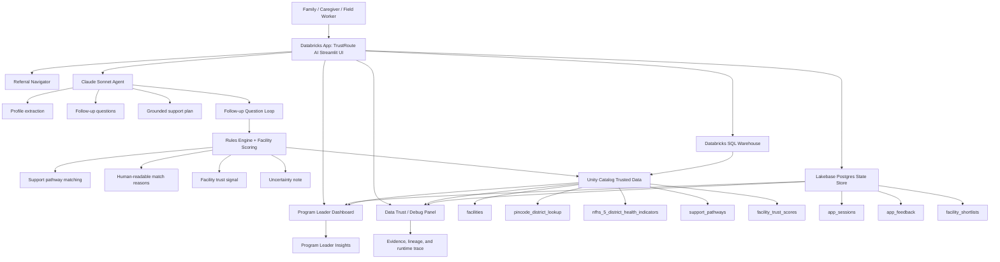

# TrustRoute AI — Architecture

> **Databricks Apps & Agents for Good Hackathon — Final Submission**  
> Evidence-backed referral guidance for families and field workers using Databricks Apps, Unity Catalog, Databricks SQL Warehouse, Claude Sonnet, deterministic rules, facility trust scoring, and Lakebase state persistence.

---

## 1. Architecture purpose

**TrustRoute AI** helps a community health worker or family-support coordinator turn a family’s plain-language situation into:

- a structured care profile
- targeted follow-up questions
- matched support pathways
- nearby facility options with trust signals
- a grounded support plan
- saved follow-up actions
- program-level analytics

The system is intentionally designed to be:

- **human-centered** for families and field workers
- **evidence-backed** through trusted data and facility records
- **transparent** about uncertainty
- **explainable** through deterministic rules and technical traces
- **persistent** through Lakebase state storage
- **demo-safe** with local fallbacks for development

---

## 2. High-level architecture flow

```text
FAMILY / FIELD WORKER
  |
  | Plain-language care need:
  | "I live in pincode 560001. I am pregnant and have a 3-year-old child.
  |  I need help with nutrition, vaccination, and finding a nearby facility."
  v
DATABRICKS APP — TRUSTROUTE AI STREAMLIT UI
  |
  | Referral Navigator
  | Program Leader Dashboard
  | Data Trust / Debug Panel
  | Shows: Data = Unity Catalog / State = Lakebase / AI = Claude Sonnet
  v
CLAUDE SONNET AGENT
  |
  | Extracts structured profile
  | Asks smart follow-up questions
  | Generates grounded support plan
  | Uses deterministic fallback only when AI is unavailable
  v
FOLLOW-UP QUESTION LOOP
  |
  | Insurance / low-cost need
  | Travel distance
  | Urgency
  | Missing location details
  | Pregnancy / child age / immunization context
  v
RULES ENGINE + FACILITY SCORING
  |
  | Matches support pathways
  | Explains why each pathway matched
  | Ranks facility options
  | Applies trust signal from facility_trust_scores or proxy evidence scoring
  v
UNITY CATALOG TRUSTED DATA
  |
  | benefits_navigator.trusted.*
  | Facilities, PIN lookup, NFHS-5 indicators, support pathways, facility trust scores
  v
DATABRICKS SQL WAREHOUSE
  |
  | Secure SQL access to Unity Catalog
  | Powers app reads and dashboard analytics
  v
LAKEBASE POSTGRES STATE STORE
  |
  | app_sessions
  | app_feedback
  | facility_shortlists
  v
PROGRAM LEADER DASHBOARD + DATA TRUST PANEL
  |
  | Demand trends
  | Facility coverage
  | District health context
  | Source status
  | Lakebase persistence trace
  v
SOCIAL IMPACT INSIGHTS
  |
  | Family-level action
  | Field-worker consistency
  | Program-leader visibility
  | Better outreach and planning decisions
```

---

## 3. Mermaid architecture diagram



---

## 4. Main user workflow

### Step 1 — Intake

The field worker enters a plain-language scenario such as:

```text
I live in pincode 560001. I am pregnant and have a 3-year-old child.
I do not know where to go for affordable health services.
I need help with nutrition, vaccination, and finding a nearby facility.
```

### Step 2 — Profile extraction

Claude Sonnet extracts a structured profile:

```text
pincode: 560001
pregnant: true
child_age_months: 36
needs: maternal care, child nutrition, child immunization, nearby facility search
```

### Step 3 — Location resolution

The app resolves PIN code `560001` using trusted PIN-code data:

```text
District: BENGALURU URBAN
State: KARNATAKA
```

### Step 4 — Follow-up question loop

The app asks only the missing details needed to route the family:

```text
Tell us about your current health insurance or cost situation.
How far can you travel to reach a health facility?
Is this urgent today, or are you planning ahead?
```

### Step 5 — Rules engine matching

The deterministic rules engine matches support pathways such as:

```text
Maternal Health Support
Child Nutrition Support
Child Immunization Support
Health Insurance / Low-Cost Care Awareness
Women Preventive Screening Support
```

Each match has a human-readable reason and a technical rule trace available behind an expander or in Data Trust / Debug.

### Step 6 — Facility trust and ranking

The app selects nearby facility options and enriches them with:

- trust signal
- score
- score source
- service/pathway relevance
- contact evidence
- location evidence
- uncertainty note

Facility scoring uses:

```text
Primary source: benefits_navigator.trusted.facility_trust_scores
Fallback: proxy evidence score from facility record completeness
```

### Step 7 — Claude support plan

Claude Sonnet writes a concise, grounded support plan. The plan does not invent programs or make unsupported eligibility claims.

### Step 8 — Persistence

The deployed app persists state in Lakebase:

```text
app_sessions
app_feedback
facility_shortlists
```

---

## 5. Databricks App layer

The Databricks App hosts the Streamlit UI.

### Main screens

| Screen | Purpose |
|---|---|
| Referral Navigator | Family / field-worker intake, follow-up questions, support plan, facility options |
| Program Leader Dashboard | Aggregated pathway demand, district context, facility coverage |
| Data Trust / Debug | Runtime mode, data source status, AI status, scoring trace, state-store status |

### Runtime badges

The final deployed app should show:

```text
Data: Unity Catalog
State: Lakebase
AI: Claude Sonnet
```

Local development can show:

```text
Data: Local sample JSON / Unity Catalog
State: SQLite
AI: Claude Sonnet / deterministic fallback
```

---

## 6. Claude Sonnet agent

Claude is used for:

- natural-language understanding
- profile extraction
- follow-up question generation
- personalized support-plan generation

Claude is **not** used to make unsupported eligibility decisions. Deterministic rules remain the source of pathway matching.

### AI safety boundaries

The plan should:

- be practical and supportive
- stay grounded in retrieved context
- tell the user to confirm facility services before visiting
- avoid diagnosis
- avoid final eligibility determination
- avoid claiming a facility is “best,” “safest,” or guaranteed

---

## 7. Follow-up loop

The follow-up loop reduces ambiguity before routing.

Common follow-up dimensions:

| Dimension | Example |
|---|---|
| Insurance / cost | “I do not have insurance and need low-cost care.” |
| Travel distance | “Up to 4 km.” |
| Urgency | “Urgent today, but not an emergency.” |
| Missing location | PIN code or district clarification |
| Child age | Needed for nutrition and immunization routing |
| Pregnancy / postpartum | Needed for maternal health support |

---

## 8. Rules engine

The deterministic rules engine provides explainable matching.

It uses:

- structured profile fields
- follow-up answers
- support pathway rules
- location context
- district health indicators

It does not invent programs or assert unsupported eligibility.

### User-facing explanation

Example:

```text
Why matched: Pregnancy mentioned in the family scenario.
```

### Technical trace

Example:

```text
pregnant=true OR recently_delivered=true
```

Technical traces are available for judges and debugging, but collapsed by default.

---

## 9. Trusted data layer — Unity Catalog

Current source of truth:

```text
Catalog: benefits_navigator
Schema: trusted
```

### Tables

| Table | Purpose |
|---|---|
| `facilities` | Healthcare facility and service-provider directory |
| `india_post_pincode_directory` | India Post PIN code geography source |
| `pincode_district_lookup` | Derived PIN-to-district/state lookup |
| `nfhs_5_district_health_indicators` | District-level public-health context |
| `support_pathways` | Deterministic support-pathway rules |
| `facility_trust_scores` | Facility evidence / trust score source |

### Data-quality handling

The app handles:

- inconsistent district names
- missing coordinates
- unavailable values such as `NA`
- suppressed NFHS values such as `*`
- parenthesized estimates such as `(29.5)`
- noisy facility contact fields
- incomplete facility service descriptions

---

## 10. Databricks SQL Warehouse

The Databricks SQL Warehouse provides secure SQL access to Unity Catalog.

It powers:

- trusted table reads
- row-count validation
- facility lookup
- PIN-to-district resolution
- NFHS district context
- support pathway retrieval
- facility trust score retrieval

---

## 11. Facility trust scoring

TrustRoute AI includes facility trust signals to help field workers understand evidence strength.

### Primary score source

```text
benefits_navigator.trusted.facility_trust_scores
```

### Fallback score source

If no trust-score row matches, the app uses proxy evidence scoring from facility record completeness.

Proxy score signals may consider:

- phone present
- address completeness
- services / specialties present
- description / evidence text present
- source identifier present
- coordinates present
- staff / bed / establishment details if available

### User-facing language

The app uses:

```text
Trust signal
Evidence strength
Score source
Uncertainty note
```

The app avoids overclaiming:

```text
Not used: best, safest, guaranteed, verified quality
```

### Facility-card caveat

```text
Trust signal reflects available evidence and data completeness — not a guarantee of service quality.
Please call to confirm current services before visiting.
```

---

## 12. Lakebase state layer

The deployed app uses Lakebase / managed Postgres for application state.

Current deployment database:

```text
Project: trustroute-ai-lakebase
Database: databricks_postgres
```

### App-created tables

| Table | Purpose |
|---|---|
| `app_sessions` | Stores intake profile, matched pathways, and session metadata |
| `app_feedback` | Stores feedback from the user |
| `facility_shortlists` | Stores saved facilities for follow-up |

### Why Lakebase is used

Lakebase provides:

- transactional state
- persistent app memory
- feedback capture
- saved facility follow-up
- foundation for program analytics

The app creates Lakebase tables automatically with `CREATE TABLE IF NOT EXISTS`.

---

## 13. Program Leader Dashboard

The Program Leader Dashboard summarizes:

- pathway demand
- district health context
- facility coverage
- facilities with contact details
- facility-trust coverage
- recent family needs
- need vs access gaps

It is designed for program leaders who need visibility into demand and coverage patterns.

---

## 14. Data Trust / Debug panel

The Data Trust / Debug panel provides transparency for judges and developers.

It shows:

- active data mode
- active state mode
- Unity Catalog table status
- Lakebase connection status
- row counts
- Claude agent trace
- profile lineage
- district matching trace
- facility scoring trace
- recent sessions
- no secret values

This panel supports the hackathon judging focus on evidence, uncertainty, and technical execution.

---

## 15. Genie / natural-language analytics

A future or optional extension is to connect the trusted analytics layer to Genie for natural-language program-leader questions such as:

```text
Which districts show high child nutrition risk?
Which support pathways are most requested?
Which facilities are missing phone numbers?
Where do we have high need but low facility coverage?
```

For the core submitted app, the Program Leader Dashboard and Data Trust panel provide the primary analytics experience.

---

## 16. Deployment modes

### Gate A — Local fallback

```text
Data: sample_data JSON
State: SQLite
AI: Claude Sonnet or deterministic fallback
```

Purpose:

- offline demo
- resilience
- rapid local development

### Gate B — Unity Catalog + SQLite

```text
Data: Unity Catalog
State: SQLite
AI: Claude Sonnet
```

Purpose:

- validate trusted data
- validate UC table access
- keep local persistence simple

### Gate C — Final deployed mode

```text
Data: Unity Catalog
State: Lakebase
AI: Claude Sonnet
Host: Databricks App
```

Purpose:

- final hackathon submission
- persistent state
- cloud-hosted demo
- judge-ready technical architecture

---

## 17. Security and privacy

TrustRoute AI follows these principles:

- no secrets in GitHub
- Databricks secrets / app resources for credentials
- Anthropic key stored as a secret
- Databricks token stored as a secret where required
- Lakebase credentials stored as secrets
- no passwords or tokens printed in logs
- no diagnosis
- no final eligibility determination
- no unsupported facility quality claims
- synthetic / demo intake data only

If any secret is exposed in chat, logs, screenshots, or files, rotate it immediately.

---

## 18. Final submission architecture summary

```text
TrustRoute AI
  = Databricks App
  + Claude Sonnet
  + Unity Catalog trusted data
  + Databricks SQL Warehouse
  + deterministic rules engine
  + facility trust scoring
  + Lakebase state persistence
  + Program Leader Dashboard
  + Data Trust / Debug trace
```

The architecture supports both family-level guidance and program-level visibility while staying grounded in trusted data and transparent uncertainty.
